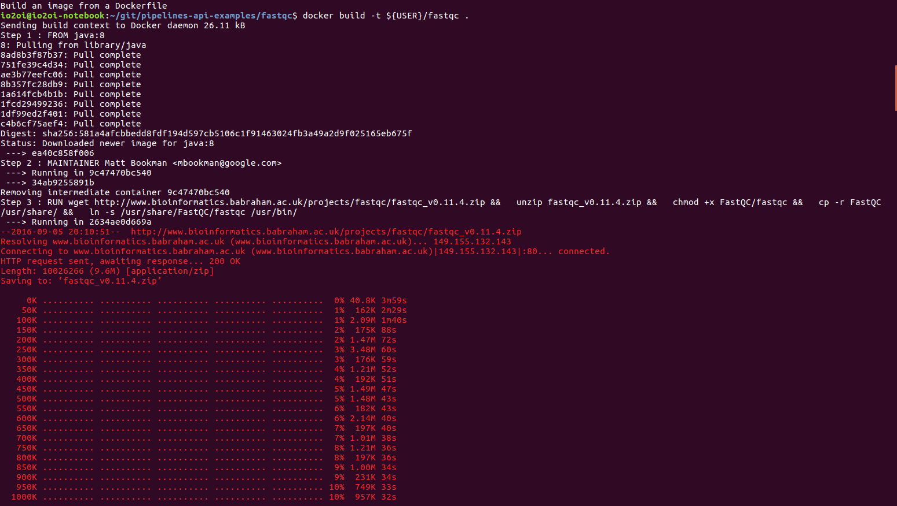

> 이 문서는 [http://googlegenomics.readthedocs.io/en/latest/use_cases/run_pipelines_in_the_cloud/index.html](http://googlegenomics.readthedocs.io/en/latest/use_cases/run_pipelines_in_the_cloud/index.html) 의 내용을 간략하게 정리한 것이다.

# Run workflows and common tasks in parallel
[연결](http://googlegenomics.readthedocs.io/en/latest/use_cases/run_pipelines_in_the_cloud/index.html)

우선 이 작업을 하기 위해서는 자신의 project id 와 bucket id를 알고 있어야 한다.

bucket id 확인: [https://console.cloud.google.com/storage](https://console.cloud.google.com/storage)
    또는 
```bash
]$ gsutil ls
```
project id 확인: [https://console.cloud.google.com/iam-admin](https://console.cloud.google.com/storage) 에서 Setting 또는
```bash
]$ gcloud config list
```

## Overview
파이프라인(pipeline) 이라는 것은 아래의 일을 포함하는 것이다.
- Path(s) of input files to read from Cloud Storage
- Path(s) of output files/directories to write to Cloud Storage
- A Docker image to run
- A command to run in the Docker image
- Cloud resources to use (number of CPUs, amount of memory, disk size and type)

Pipelines API 는 다음의 일들을 한다.
- Create a Compute Engine virtual machine
- Download the Docker image
- Download the input files
- Run a new Docker container with the specified image and command
- Upload the output files
- Destroy the Compute Engine virtual machine
- Log files are uploaded periodically to Cloud Storage.

실제의 예제를 보면서 파악해 보자
*이 Pipeline API는 실행할 동안에만 존재하는 가상머신이나 파일들에 기반하여 작동한다. 고정되어 있는 가상머신등을 사용하고 싶을 때는 Grid Engine 을 사용하자*

## 실제 예제
### 시작하기 전에 필요한 것
- Clone or fork [example repository](https://github.com/googlegenomics/pipelines-api-examples/).
- If you plan to create your own Docker images, then install docker: https://docs.docker.com/engine/installation/#installation
- Follow the Google Genomics [getting started instructions](https://cloud.google.com/genomics/install-genomics-tools#create-project-and-authenticate) to set up your Google Cloud Project. The Pipelines API requires that the following are enabled in your project:
 - [Genomics API](https://console.cloud.google.com/project/_/apis/api/genomics)
 - [Cloud Storage API](https://console.cloud.google.com/project/_/apis/api/storage_api)
 - [Compute Engine API](https://console.cloud.google.com/project/_/apis/api/compute_component)
- Follow the Google Genomics [getting started instructions](https://cloud.google.com/genomics/install-genomics-tools#install-genomics-tools) to install and authorize the Google Cloud SDK.
- Install or update the python client via ```pip install --upgrade google-api-python-client```. For more detail see [https://cloud.google.com/genomics/v1/libraries]( gs://genomics-public-data/ftp-trace.ncbi.nih.gov/1000genomes/ftp/technical/working/20140123_NA12878_Illumina_Platinum/**.vcf.gz).

### command line 을 이용해서 api 이용
[연결](https://cloud.google.com/genomics/v1alpha2/pipelines-api-command-line)을 참조하면 됨.
아래에서는 python 코드를 이용해서 api에 접근하기 위한 예제를 보려고 함

### Compress or Decompress Files
[원본연결](https://github.com/googlegenomics/pipelines-api-examples/tree/master/compress)

시작하기 전에 아래와 같이 git repository를 clone 하고 compress 예제 디렉토리로 working directory를 옮긴다.
```bash
]$ cd <your git directory> 
]$ git clone https://github.com/googlegenomics/pipelines-api-examples.git
]$ cd <your git directory>/pipelines-api-examples/compress
```
여기서는  ```gs://genomics-public-data/ftp-trace.ncbi.nih.gov/1000genomes/ftp/technical/working/20140123_NA12878_Illumina_Platinum/**.vcf.gz``` 에 있는 파일을 docker ubuntu 이미지의 gzip 과 gunzip 을 이용해서 압축하고 풀면서 수행자가 가지고 있는 bucket에 결과를 복사하는 과정이다.

위의 원본에 들어가면 실행하기 위한 명령어가 나와 있다.
```bash
PYTHONPATH=.. python ./run_compress.py \
  --project YOUR-PROJECT-ID \
  --zones "us-*" \
  --disk-size 200 \
  --operation "gunzip" \
  --input gs://genomics-public-data/ftp-trace.ncbi.nih.gov/1000genomes/ftp/technical/working/20140123_NA12878_Illumina_Platinum/**.vcf.gz \
  --output gs://YOUR-BUCKET/pipelines-api-examples/compress/output \
  --logging gs://YOUR-BUCKET/pipelines-api-examples/compress/logging \
  --poll-interval 20
```
먼저 python 코드를 보면 어떤 일을 하는지 대략적으로 파악 가능함

1. 라이브러리 import 부분

```python
# python library 로 부터
import argparse
import pprint

# google api python client 로 부터
from oauth2client.client import GoogleCredentials
from apiclient.discovery import build

# PYTHONPATH에 새롭게 넣은 라이브러리로부터
from pipelines_pylib import defaults
from pipelines_pylib import poller

```
2. genome cloud 연결

```python
# Create the genomics service
credentials = GoogleCredentials.get_application_default()
service = build('genomics', 'v1alpha2', credentials=credentials)
```

3. google.pipeline.run api 실행

```python
operation = service.pipelines().run(body={
  # The ephemeralPipeline provides the template for the pipeline
  # The pipelineArgs provide the inputs specific to this run

  # There are some nuances in the API that are still being ironed out
  # to make this more compact.

  'ephemeralPipeline': {
    'projectId': args.project,
    'name': 'compress',
    'description': 'Compress or decompress a file',

    # Define the resources needed for this pipeline.
    'resources': {
      # Create a data disk that is attached to the VM and destroyed when the
      # pipeline terminates.
      'disks': [ {
        'name': 'datadisk',
        'autoDelete': True,

        # Within the Docker container, specify a mount point for the disk.
        # The pipeline input argument below will specify that inputs should be
        # written to this disk.
        'mountPoint': '/mnt/data',
      } ],
    },

    # Specify the Docker image to use along with the command
    'docker': {
      'imageName': 'ubuntu', # Stock ubuntu contains the gzip, bzip2 commands

      'cmd': ('cd /mnt/data/workspace && '
              'for file in $(/bin/ls); do '
                '%s ${file}; '
              'done' % args.operation),
    },

    # The Pipelines API currently supports full GCS paths, along with patterns (globs),
    # but it doesn't directly support a list of files being passed as a single input
    # parameter ("gs://bucket/foo.bam gs://bucket/bar.bam").
    #
    # We can simply generate a series of inputs (input0, input1, etc.) to support this here.
    #
    # 'inputParameters': [ {
    #   'name': 'inputFile0',
    #   'description': 'Cloud Storage path to an input file',
    #   'localCopy': {
    #     'path': 'workspace/',
    #     'disk': 'datadisk'
    #   }
    # }, {
    #   'name': 'inputFile1',
    #   'description': 'Cloud Storage path to an input file',
    #   'localCopy': {
    #     'path': 'workspace/',
    #     'disk': 'datadisk'
    #   }
    # <etc>
    # } ],

    # The inputFile<n> specified in the pipelineArgs (see below) will specify the
    # Cloud Storage path to copy to /mnt/data/workspace/.

    'inputParameters': [ {
      'name': 'inputFile%d' % idx,
      'description': 'Cloud Storage path to an input file',
      'localCopy': {
        'path': 'workspace/',
        'disk': 'datadisk'
      }
    } for idx in range(len(args.input)) ],

    # By specifying an outputParameter, we instruct the pipelines API to
    # copy /mnt/data/workspace/* to the Cloud Storage location specified in
    # the pipelineArgs (see below).
    'outputParameters': [ {
      'name': 'outputPath',
      'description': 'Cloud Storage path for where to FastQC output',
      'localCopy': {
        'path': 'workspace/*',
        'disk': 'datadisk'
      }
    } ]
  },

  'pipelineArgs': {
    'projectId': args.project,

    # Override the resources needed for this pipeline
    'resources': {
      # Expand any zone short-hand patterns
      'zones': defaults.get_zones(args.zones),

      # For the data disk, specify the size
      'disks': [ {
        'name': 'datadisk',

        'sizeGb': args.disk_size,
      } ]
    },

    # Pass the user-specified Cloud Storage paths as a map of input files
    # 'inputs': {
    #   'inputFile0': 'gs://bucket/foo.bam',
    #   'inputFile1': 'gs://bucket/bar.bam', 
    #   <etc>
    # }
    'inputs': {
      'inputFile%d' % idx : value for idx, value in enumerate(args.input)
    },

    # Pass the user-specified Cloud Storage destination path of output
    'outputs': {
      'outputPath': args.output
    },

    # Pass the user-specified Cloud Storage destination for pipeline logging
    'logging': {
      'gcsPath': args.logging
    },
  }
}).execute()

```
파악 했으면 위의 명령어 실행
실행 뒤에 자신의 bucket을 확인하면 결과물이 생성된 것을 볼 수 있다.

### example 2: Run FASTQC on a list of BAM or FASTQ files
[연결](https://github.com/googlegenomics/pipelines-api-examples/tree/master/fastqc)
1. docker image를 만든다
```bash
git clone https://github.com/googlegenomics/pipelines-api-examples.git
cd pipelines-api-examples/fastqc/
docker build -t ${USER}/fastqc .
```

```]$ docker images``` 하면 생성된 ${USER}/fastqc 와 java image를 볼 수 있음
*스스로 DockerFile 을 열어서 무슨 일을 하는 지 알아보자*

2. local 에서 docker image가 잘 작동하는 지 확인
```bash
fastqc]$ ./local/test_fastqc.sh
```
*이 파일도 직접 열어서 확인해 보자*
결과물이 `./test_mnt` 에 생긴 것 확인

3. google container repository 에 docker image 올릴 것
```bash
docker tag ${USER}/fastqc gcr.io/YOUR-PROJECT-ID/fastqc
gcloud docker push gcr.io/YOUR-PROJECT-ID/fastqc
```
   - 이것을 어디서 확인 할 수 있을까?
   나의 경우 ```artifacts.YOUR-BUCKET``` 이 새로 생긴 것을 ```]$ gsutil ls``` 해보면 확인 할 수 있었음

4. pipeline을 돌린다
```bash
PYTHONPATH=.. python cloud/run_fastqc.py \
  --project YOUR-PROJECT-ID \
  --zones "us-*" \
  --disk-size 100 \
  --input \
    gs://genomics-public-data/ftp-trace.ncbi.nih.gov/1000genomes/ftp/technical/pilot3_exon_targetted_GRCh37_bams/data/NA06986/alignment/NA06986.chromMT.ILLUMINA.bwa.CEU.exon_targetted.20100311.bam \
    gs://genomics-public-data/ftp-trace.ncbi.nih.gov/1000genomes/ftp/technical/pilot3_exon_targetted_GRCh37_bams/data/NA18628/alignment/NA18628.chromY.LS454.ssaha2.CHB.exon_targetted.20100311.bam \
  --output gs://YOUR-BUCKET/pipelines-api-examples/fastqc/output \
  --logging gs://YOUR-BUCKET/pipelines-api-examples/fastqc/logging \
  --poll-interval 20
  ```
   - 앞의 compress example 과 다른 점은 docker image 를 ubuntu 라고 하는 이미 존재하는 image가 아니라 방금 생성 한 image를 사용한 다는 점이다
   ```python
    # Specify the Docker image to use along with the command
    'docker': {
      'imageName': 'gcr.io/%s/fastqc' % args.project,

      # The Pipelines API will create the input directory when localizing files,
      # but does not create the output directory.
      'cmd': ('mkdir /mnt/data/output && '
              'fastqc /mnt/data/input/* --outdir=/mnt/data/output/'),
    },
   ```
   - (참고) gs://genomics-public-data/ftp-trace.ncbi.nih.gov/1000genomes/ftp/technical/pilot3_exon_targetted_GRCh37_bams/data/NA06986/alignment/ 에는 총 81개의 파일이 있음. 

5. 결과 확인
```bash
]$ gsutil ls -r gs://peppy-castle-141204.appspot.com/pipelines-api-examples/fastqc/
```

### example 3: Use samtools to create a BAM index file
[link](https://github.com/googlegenomics/pipelines-api-examples/tree/master/samtools)
이 예에서는 위와 크게 다르지 않은 예를 보여준다. 
다만 python api 사용법외에 gcloud command 를 이용해서도 사용 가능함을 보인다.

### 나머지 생략


***
# Create a Grid Engine cluster on Compute Engine
## Run workflows and common tasks in parallel
[연결](http://googlegenomics.readthedocs.io/en/latest/use_cases/run_pipelines_in_the_cloud/index.html)

## Create a Grid Engine cluster on Compute Engine
[연결](http://googlegenomics.readthedocs.io/en/latest/use_cases/setup_gridengine_cluster_on_compute_engine/index.html)