# Ch7 R Graphics
Sejin Park  
2016 10 22   


## Lattice 

Graph package for Trellis

### Trellis

- Bill Cleveland
- multipanel conditioning for categorical variable

## Dataset : autompg

398대의 자동차 연비

### 변수 설명

- mpg:연비
- cylinder : 실린더수
- displacement : 배기량
- horsepower : 마력
- weight : 무게
- acceleration : 가속능력
- year : 연도 
- origin : 만들어진 곳
- name : 차종 


```r
autompg <- read.csv("data/auto-mpg.csv", header = TRUE, na.string = ".")
dim(autompg)
```

```
## [1] 398   9
```

```r
head(autompg)
```

```
##   mpg cylinder displacement horsepower weight acceleration year origin
## 1  18        8          307        130   3504         12.0   70      1
## 2  15        8          350        165   3693         11.5   70      1
## 3  18        8          318        150   3436         11.0   70      1
## 4  16        8          304        150   3433         12.0   70      1
## 5  17        8          302        140   3449         10.5   70      1
## 6  15        8          429        198   4341         10.0   70      1
##                        name
## 1 chevrolet chevelle malibu
## 2         buick skylark 320
## 3        plymouth satellite
## 4             amc rebel sst
## 5               ford torino
## 6          ford galaxie 500
```

## Dataset : tipping 

### tipping 자료

레스토랑 고객들의 팁에 대한 습성을 알아보기 위하여 미국 뉴욕 근교에서 수집된 자료

### 변수 설명

- obs : 관측번호
- totbill : 전체 가격
- tip : 팁
- sex : 계산한 사람의 성별 
- smoker : 흡연석/금연석
- day : 요일
- time : 점심/저녁
- size : 일행수 
- tiprate = tip/totbill*100 전체가격에 대한 팁의 비율 


```r
tipping <- read.csv("./data/tips.csv", header = TRUE)
tipping$tiprate <- tipping$tip/tipping$totbill*100
dim(tipping)
```

```
## [1] 244   9
```

```r
head(tipping)
```

```
##   obs totbill  tip    sex     smoker day   time size   tiprate
## 1   1   16.99 1.01 Female Non-smoker Sun Dinner    2  5.944673
## 2   2   10.34 1.66   Male Non-smoker Sun Dinner    3 16.054159
## 3   3   21.01 3.50   Male Non-smoker Sun Dinner    3 16.658734
## 4   4   23.68 3.31   Male Non-smoker Sun Dinner    2 13.978041
## 5   5   24.59 3.61 Female Non-smoker Sun Dinner    4 14.680765
## 6   6   25.29 4.71   Male Non-smoker Sun Dinner    4 18.623962
```

## Lattice : Graph for One variable

### 막대그래프

범주형 변수의 각 범주에 대한 도수를 막대그림으로 나타낸 것
barchart 함수를 이용
문자형 또는 factor 변수를 이용

기본형 = 가로형 막대 그림 


```r
library(lattice)
barchart(as.factor(autompg$cylinder))
```

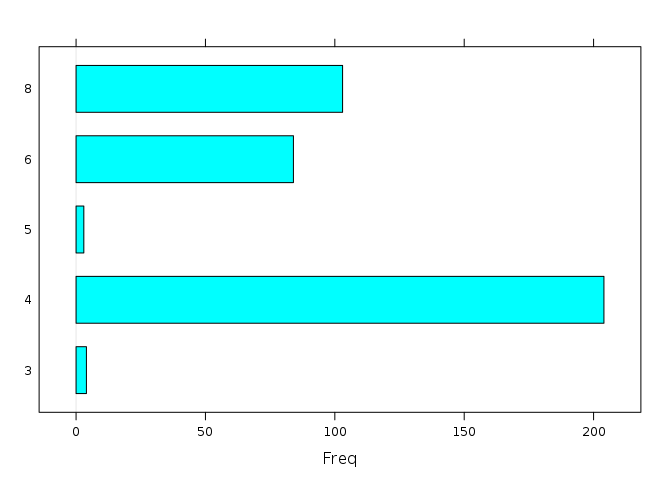<!-- -->

세로형 막대그래프 horizontal = FALSE 옵션 사용 


```r
barchart(as.factor(autompg$year), horizontal = FALSE)
```

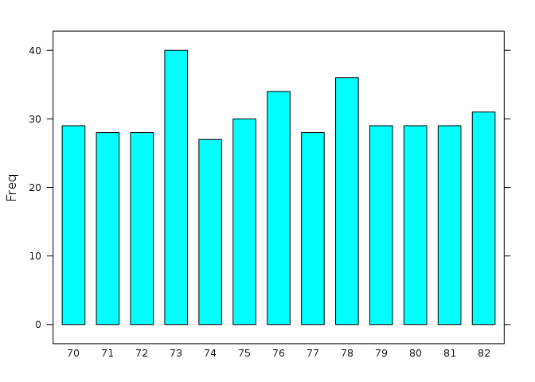<!-- -->

### Histogram
연속자료의 분포를 쉽게 파악하기 위하여 그리는 그림
histogram()
숫자 변수 이용 

```r
histogram(tipping$tip)
```

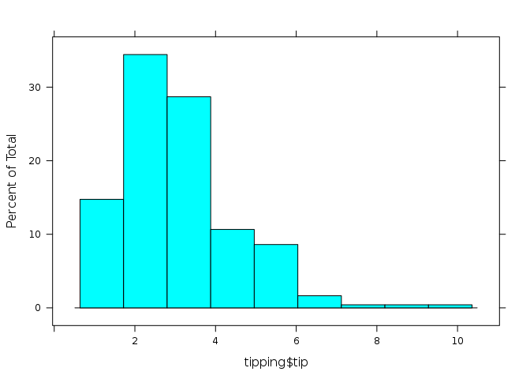<!-- -->

breaks 옵션을 이용하여 binwidth 설정
main 옵션을 이용하여 그림의 title 지정 


```r
histogram(tipping$tip, breaks = seq(0,11,0.5), main = "binwidth = 50 cent")
```

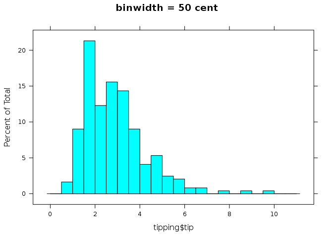<!-- -->

```r
histogram(tipping$tip, breaks = seq(0,11,0.25), main = "binwidth = 25 cent")
```

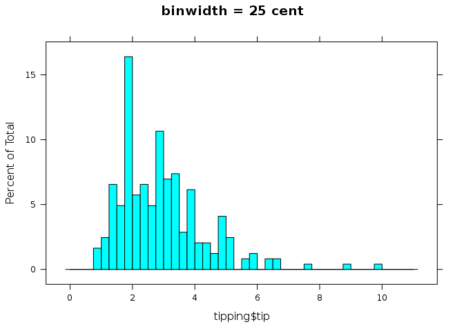<!-- -->


binwidth 를 달리하면 다른 패턴을 발견할 수 있다. 


```r
histogram(tipping$tip, breaks = seq(0,11,0.1), main = "binwidth = 10 cent")
```

<!-- -->

```r
histogram(tipping$tip, breaks = seq(0,11,0.05), main = "binwidth = 5 cent")
```

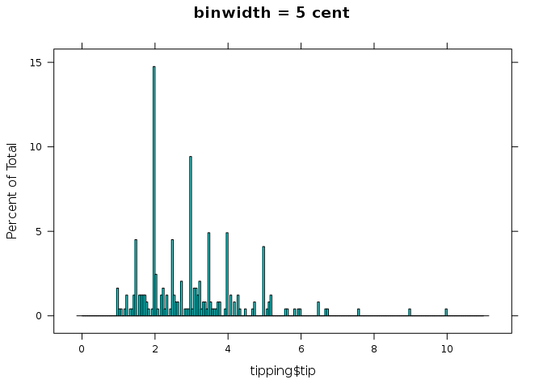<!-- -->

### 밀도 그림 
- 연속자료의 분포를 파악하기 위해 그린 그림
density 함수 이용
xlab 옵션을 이용하여 X축 레이블 지정 


```r
densityplot(autompg$mpg, xlab="mpg")
```

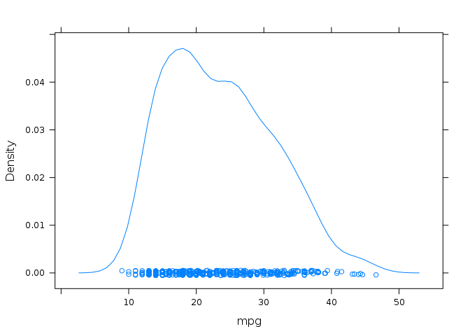<!-- -->

## Lattice : Graph for Two variable

### Continuous vs Continuous

- scatter plot : 2 continuous variable
- xyplot()
- " y ~ x"


```r
xyplot(tip ~ totbill, pch = 16, data = tipping)
```

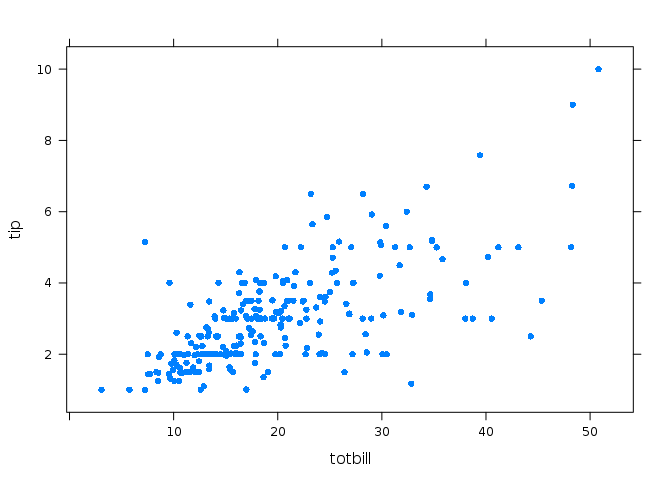<!-- -->

 " y ~ x | categorical variable"


```r
xyplot(tip ~ totbill | sex, pch = 16, data = tipping)
```

<!-- -->


```r
xyplot(tip ~ totbill | sex, group = smoker, pch = c(16, 1), data = tipping)
```

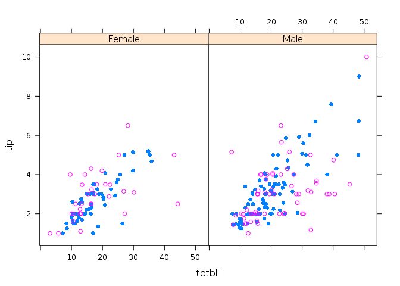<!-- -->

### panel 

* panel.grid

- "h = -1" 수평으로 각 눈금마다 눈금선 넣기
- "v = 2" 수직으로 2개 눈금선 넣기

* panel.xyplot()

- "pch = 16" (*)

* panel.lmline


```r
xyplot(tip ~ totbill | sex + smoker, 
  data = tipping,
  panel = function(x, y){
   panel.grid(h = -1, v = 2)
   panel.xyplot(x,y,pch=16)
   panel.lmline(x,y)
  })
```

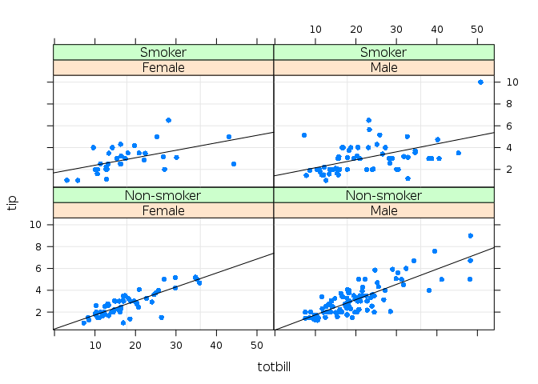<!-- -->

## Continuous vs Categorical

### boxplot : 각 범주별로 연속변수의 분포를 비교
bwplot()

- 기본 : 가로 
- horizontal = FALSE : 세로

```r
bwplot(cylinder ~ mpg, data = autompg)
```

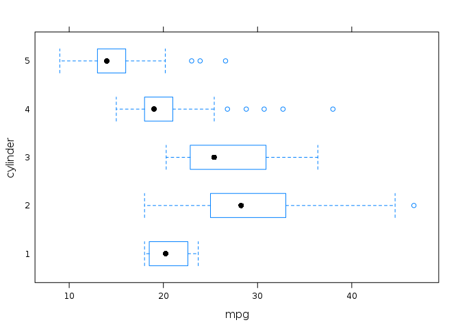<!-- -->

```r
bwplot(cylinder ~ mpg, data = autompg, horizontal = FALSE)
```

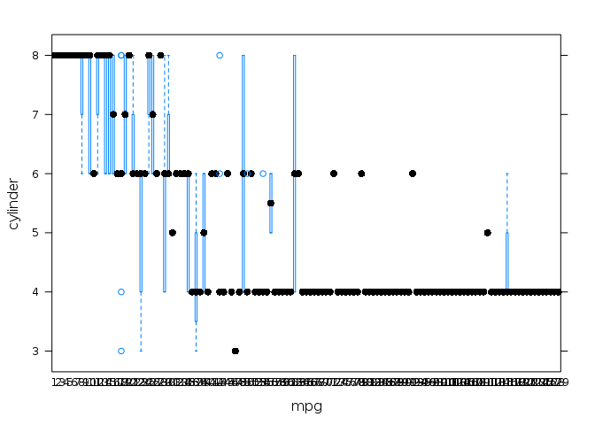<!-- -->

### dotplot
dotplot()


```r
dotplot(as.factor(cylinder)~mpg, data = autompg)
```

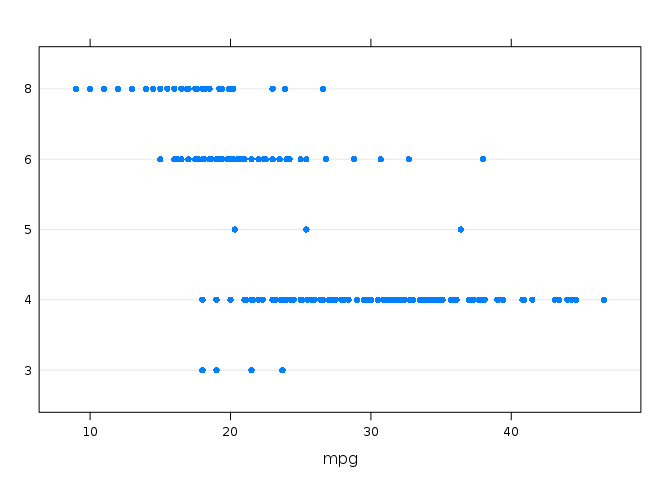<!-- -->

## Categorical vs Categorical

- mosaic 그림 : 이차원 분할표로 정리된 자료에서 범주형 변수 중 하나의 변수를 조건으로 나머지 변수의 분포를 나타내는 그림 
- Trellis 형태의 mosaic 그림은 vcd 패키지에서 mosaic 함수로 제공 - '~ A + B'의 식에서는 A변수를 조건으로 A변수의 각 범주 내에서 B 변수의 범주비율을 그림으로 나타냄

mosaic()


```r
library(vcd)
```

```
## Loading required package: grid
```

```r
mosaic( ~ sex + size, data =tipping)
```

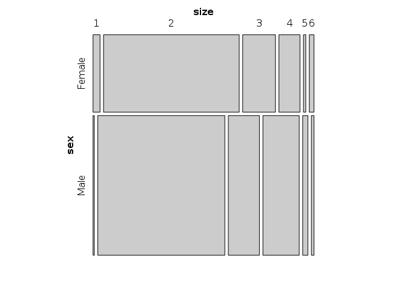<!-- -->

```r
mosaic( ~ size + sex, data =tipping)
```

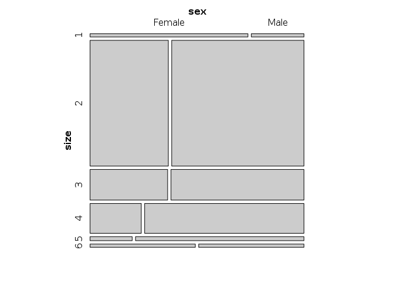<!-- -->

cotabplot()


```r
cotabplot( ~ size + sex | smoker, data = tipping, panel = cotab_mosaic)
```

<!-- -->

## multivariate

여러개의 연속변수를 동시에 살펴보기 위한 그림
두 연속변수씩 짝지어 그린 산점도를 행렬 형태로 나타낸 것
splom 함수를 이용하여 그림 

autompg[, c(1,3:6)] 연속형 변수만 선택


```r
splom(~autompg[,c(1,3:6)], data = autompg)
```

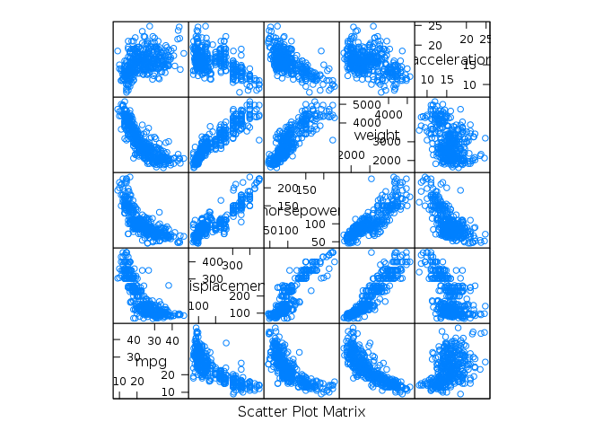<!-- -->

group, pch, col 등의 옵션으로 점의 모양, 색깔을 그룹별로 지정
key 옵션을 이용하여 범례 내용을 명시


```r
splom(~autompg[c(1,3:6)], groups = cylinder , data = autompg,
  col = c("red", "orange", "blue", "green", "grey50"),
  pch = c(16,2,15,3,1), cex = 0.7, 
  key = list(title = "Various cylinders in autompg",
     columns = 5,
     points = list(pch = c(16, 2, 15, 3, 1),
        col = c("red", "orange", "blue", "green","grey50")),
     text = list(c("3","4","5","6","8"))))
```

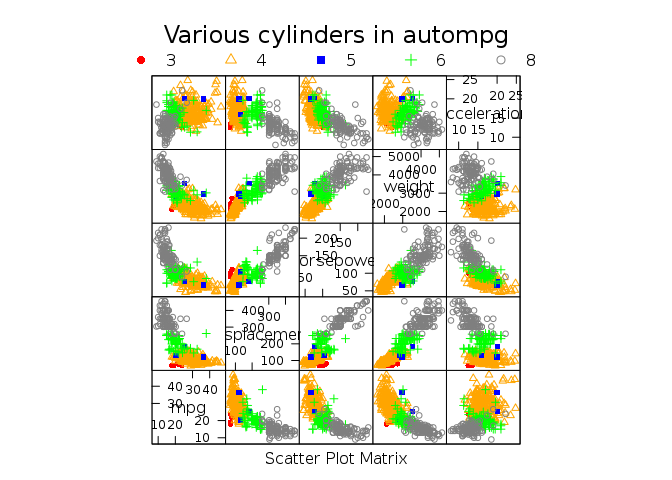<!-- -->


### paralleplot

연속변수의 수가 많아 산점도 행렬로 파악이 힘든 경우 이용
parallelplot()
기본 수평, 
horizontal = FALSE 수직 


```r
parallelplot(~ autompg[,c(1,3:6)], data = autompg, horizontal = FALSE)
```

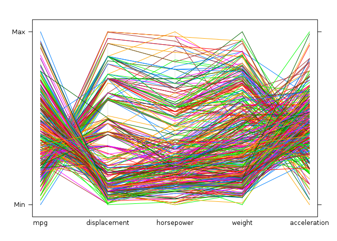<!-- -->

조건식을 이용 여러 그룹별로 평행좌표 그림 따로 그려 비교 


```r
parallelplot(~ autompg[,c(1,3:6)] | as.factor(cylinder), data = autompg, horizontal = FALSE)
```

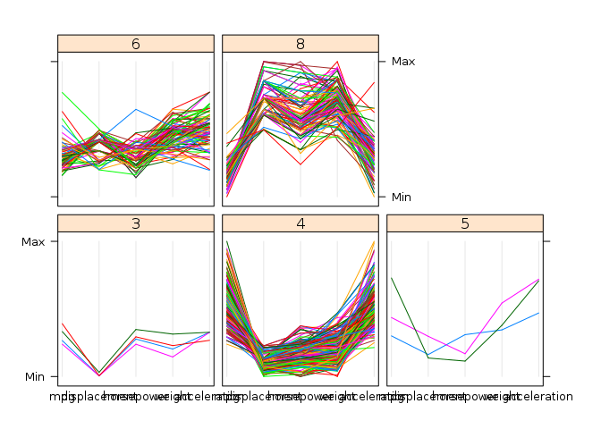<!-- -->


## 3D scatter plot

- 연속변수가 3개인 경우 3차원 상에서의 자료분포를 알아보기 위한 그림 
- cloud 함수를 이용, 'Z ~ X*Y' 형태의 식으로 이용 


```r
cloud(mpg~horsepower*displacement, data = autompg, 
  screen = list(x=-80, y=70))
```

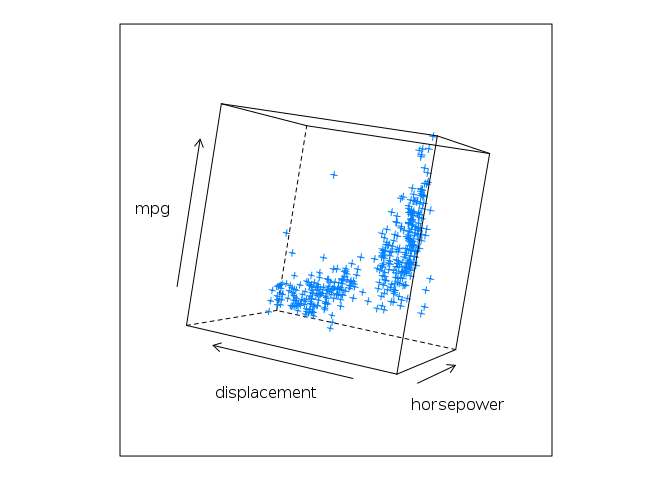<!-- -->

## Grammer of Graphics

2005 Wilkinson 
Layered grammar of graphics 

- ggplot2
- qplot, ggplot 

## DATATSET : abalone 

* 전복의 나이를 예측하기 위하여 성별, 길이, 무게 등을 측정한 자료
###  변수 설명
- sex : 수컷(M), 암컷(F), 유아기(I)
- height : 껍질 안의 몸통 길이
- diameter : length에 수직인 길이
- shuckedW : 껍질을 제외한 무게
- wholeW : 전체 무게
- shellW : 껍질 무게
- visceraW : 내장 무게
- rings ; 링의 수(나이를 나타냄)
- length : 껍질 중 가장 긴 부분의 길이 


```r
abalone <- read.csv("data/abalone.csv", header = TRUE)
dim(abalone)
```

```
## [1] 4177    9
```

```r
head(abalone)
```

```
##   sex length diameter height wholeW shuckedW visceraW shellW rings
## 1   M  0.455    0.365  0.095 0.5140   0.2245   0.1010  0.150    15
## 2   M  0.350    0.265  0.090 0.2255   0.0995   0.0485  0.070     7
## 3   F  0.530    0.420  0.135 0.6770   0.2565   0.1415  0.210     9
## 4   M  0.440    0.365  0.125 0.5160   0.2155   0.1140  0.155    10
## 5   I  0.330    0.255  0.080 0.2050   0.0895   0.0395  0.055     7
## 6   I  0.425    0.300  0.095 0.3515   0.1410   0.0775  0.120     8
```

## DATATSET : Pconsump 

2006년 12월부터 2010년 11월까지 47개월간 프랑스의 한 지역에서 수집된 원 자료 중 2006년 12월 17일, 18일, 그리고 2007년 12월 17일, 18일을 추출한 자료 

### 변수 설명

- Date : 날짜
- Time : 시간
- X1 : 평균 유효전력 
- X2 : 평균 무효전력
- X3 : 평균 전압 
- X4 : 전류 강도
- X5 : 보조계량기1
- X6 : 보조계량기2
- X7 : 보조계량기3


```r
Pconsump <- read.csv("data/power_consumption.csv")
dim(Pconsump)
```

```
## [1] 5760    9
```

```r
head(Pconsump)
```

```
##         Date    Time    X1    X2     X3   X4 X5 X6 X7
## 1 17/12/2006 0:00:00 1.044 0.152 242.73  4.4  0  2  0
## 2 17/12/2006 0:01:00 1.520 0.220 242.20  7.4  0  1  0
## 3 17/12/2006 0:02:00 3.038 0.194 240.14 12.6  0  2  0
## 4 17/12/2006 0:03:00 2.974 0.194 239.97 12.4  0  1  0
## 5 17/12/2006 0:04:00 2.846 0.198 240.39 11.8  0  2  0
## 6 17/12/2006 0:05:00 2.848 0.198 240.59 11.8  0  1  0
```

## Scatterplot : qplot()

qplot(x,y,data= dataset)

```r
library(ggplot2)
qplot(length, wholeW, data = abalone)
```

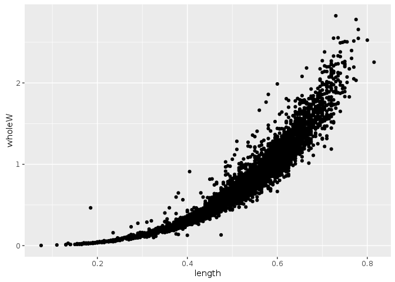<!-- -->

colour, shape


```r
qplot(length, wholeW, data = abalone, colour = sex, shape = sex)
```

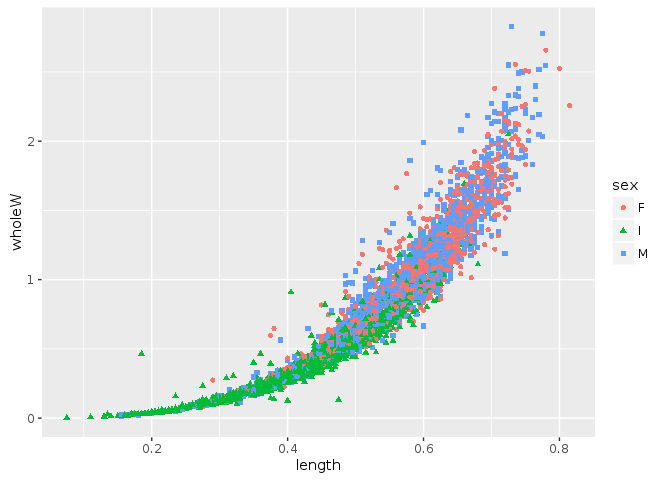<!-- -->

alpha


```r
qplot(length, wholeW, data = abalone, alpha=I(1/10))
```

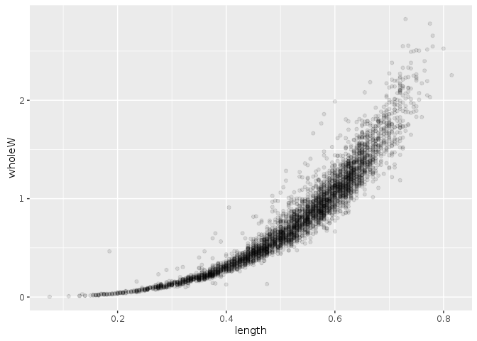<!-- -->

geom = "boxplot"
X : categorical variable


```r
qplot(sex, wholeW, data = abalone, geom = "boxplot")
```

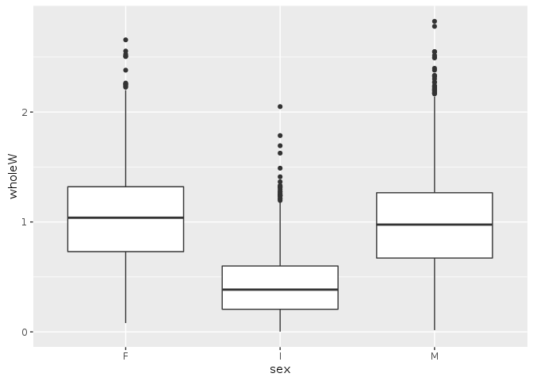<!-- -->


```r
qplot(factor(rings), wholeW, data = abalone, geom = "boxplot")
```

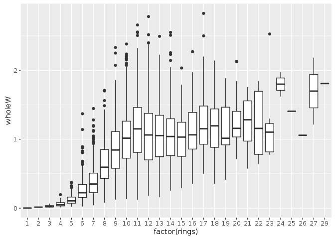<!-- -->

geom = jittering

```r
qplot(sex, wholeW, data = abalone, geom = "jitter")
```

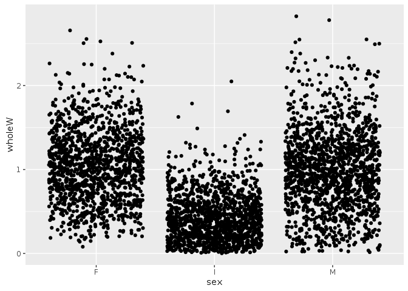<!-- -->

geom = jitter & alpha


```r
qplot(sex, wholeW, data = abalone, geom = "jitter", alpha = I(1/3))
```

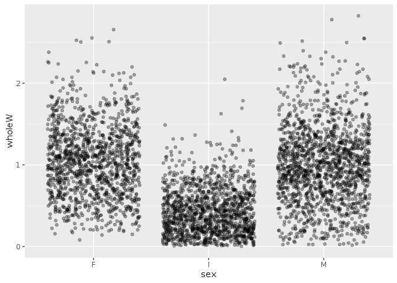<!-- -->

geom = "histogram"
fill = categorical variable 

```r
qplot(wholeW, data = abalone, geom = "histogram", binwidth = 0.05, fill = sex)
```

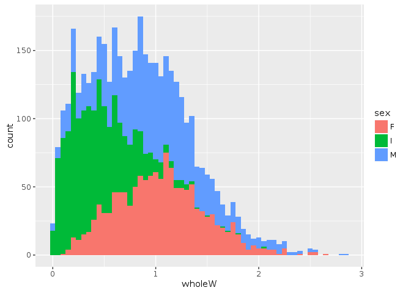<!-- -->

facets = .~B


```r
qplot(wholeW, data = abalone, geom = "histogram", binwidth = 0.05, facets = .~sex)
```

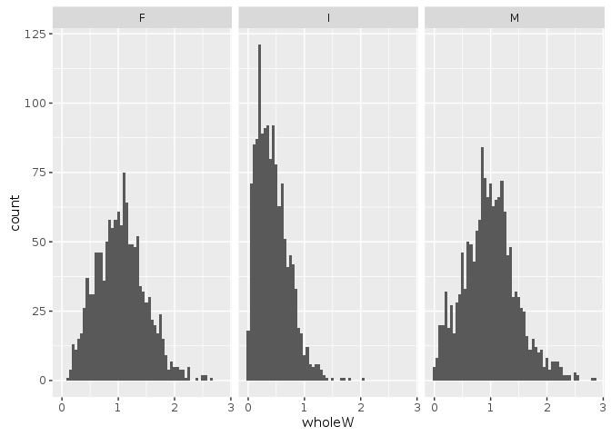<!-- -->


## Date, Time 
as.POSIXlt
%d (날짜, 01~31), %m (달, 01~12), %Y (4자리로 표시된 연도)
%H (시간, 00~23), %M (분, 00~59), %S (초, 00~59)


```r
class(Pconsump$Date) 
```

```
## [1] "factor"
```

```r
class(Pconsump$Time) 
```

```
## [1] "factor"
```

```r
Pconsump$newDate <- as.POSIXlt(Pconsump$Date,format="%d/%m/%Y")
Pconsump$newTime <- as.POSIXlt(Pconsump$Time,format="%H:%M:%S")
Pconsump$year <- format(Pconsump$newDate,"%Y")
```

## Timeseries plot 

geom = "line"

```r
Pconsump.2006.12.17 <- Pconsump[Pconsump$Date == "17/12/2006",]
qplot(newTime, X3, data = Pconsump.2006.12.17, geom = "line")
```

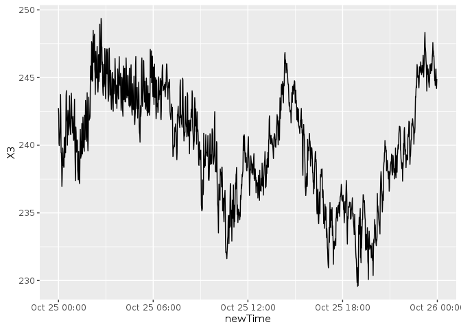<!-- -->

color와 linetype 옵션을 이용하여 범주별로 다른 선으로 표시


```r
Pconsump.12.17<- Pconsump[(Pconsump$Date == "17/12/2006" |Pconsump$Date == "17/12/2007"), ]
qplot(newTime, X3, data = Pconsump.12.17, color = year, geom = "line", linetype = year)
```

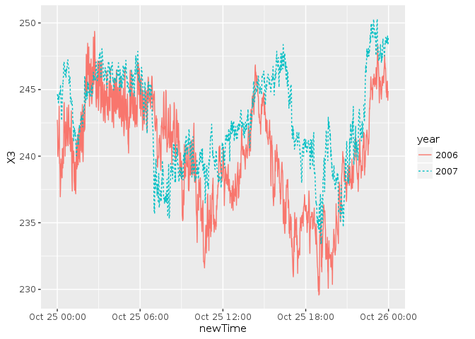<!-- -->

facets = A ~. 

```r
qplot(newTime, X3, data = Pconsump, facets = Date~., geom = "line")
```

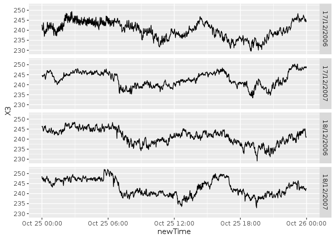<!-- -->

## ggplot - aesthetic mapping 
ggplot : dataframe
aes()

- x
- y
- color
- shape
- size 


```r
plot.basic <- ggplot(tipping, aes(x = totbill,
         y = tip,
         color = sex,
         shape = sex,
         size = tiprate))
```

Scatterplot : layer(geom = "point")
geom_point()


```r
# plot.basic + layer(geom = "point")
# Error: Attempted to create layer with no stat.
plot.basic + geom_point()
```

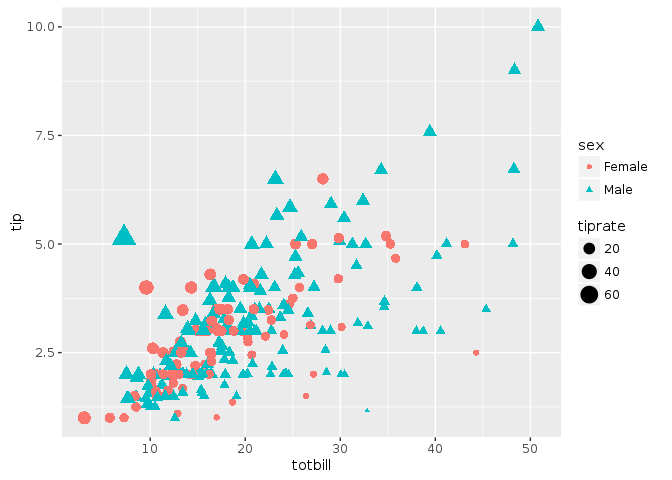<!-- -->

geom : geom_이름()의형태로이용

- abline : 절편과기울기를이용하여그리는직선
- area : 영역그림
- bar : 막대그림(Y축에지정된변수를이용)
- boxplot : 상자그림
- density : smoothdensity
- histogram : 히스토그램
- hline/vline : 수평직선/수직직선
- jitter : 점흐트려그리기
- line : x값순서로점연결하여그리는직선
- smooth : Smoothline


```r
plot.basic + geom_point() + geom_smooth(aes(group = sex))
```

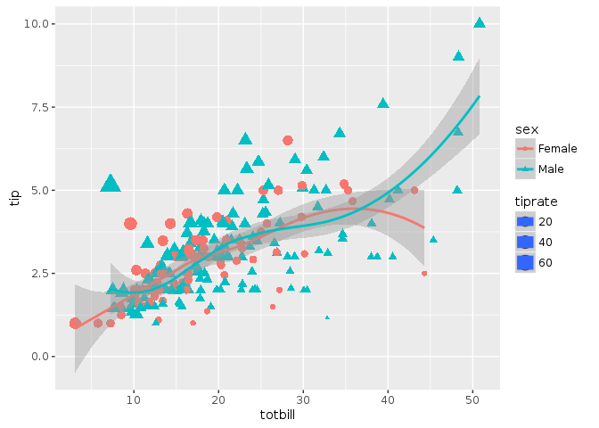<!-- -->

## stst : stat_이름( )의 형태로 이용

- bin : 범주화자료로만들기
- boxplot : 상자그림을위한통계량계산
- contour : 3차원등고선도를위한자료생성
- density : 1차원밀도함수계산
- density_2d : 2차원밀도함수계산
- identity : 통계량을계산하지않고원자료를그대로이용
- qqQQ-plot : 을위한통계량계산
- quantile : 분위수계산
- step : 계단함수형태의그림을위한값계산
- summary : 같은x값에대하여y의통계량을계산


### 다양한 stat을 이용한 그래프

산점도에 통계량을 이용한 점 찍기


```r
plot.stat <- ggplot(abalone, aes(x=rings,y=log(wholeW)))
plot.stat + geom_point(shape=1) + 
 stat_summary(size=3, shape=15, color="red",
        fun.y="mean", geom = "point")
```

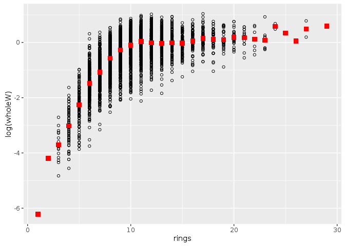<!-- -->

fun.data = "mean_cl_normal" 

```r
plot.stat + stat_summary(fun.data = "mean_cl_normal", geom="errorbar")
```

```
## Warning: Removed 5 rows containing missing values (geom_errorbar).
```

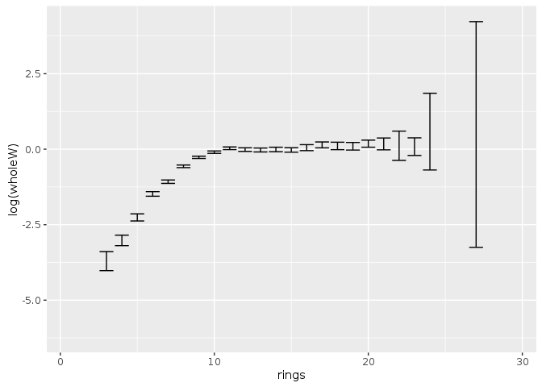<!-- -->


```r
q1 <- function(x) quantile(x, p=0.25)
q3 <- function(x) quantile(x, p=0.75)

plot.stat + 
 stat_summary(aes(color="Q1",shape="Q1"), fun.y=q1,geom="point") +
 stat_summary(aes(color="median ",shape="median "), fun.y=median,geom="point") +
 stat_summary(aes(color="Q3",shape="Q3"), fun.y=q3,geom="point") +
 stat_summary(aes(color="min ",shape="min "), fun.y=min,geom="point") +
 stat_summary(aes(color="max",shape="max"), fun.y=max,geom="point") +
 scale_color_hue("Quartile ")+scale_shape("Quartile")
```

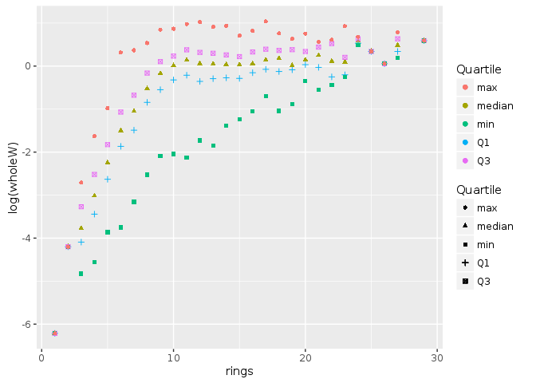<!-- -->

stat_bin, geom


```r
plot.1D <- ggplot(tipping, aes(x=tip))
plot.1D + geom_histogram() + ggtitle("geom histogram")
```

```
## `stat_bin()` using `bins = 30`. Pick better value with `binwidth`.
```

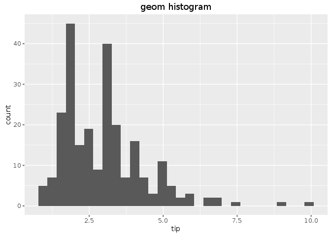<!-- -->

```r
plot.1D + stat_bin(geom = "area") + ggtitle("stat_bin, geom_area")
```

```
## `stat_bin()` using `bins = 30`. Pick better value with `binwidth`.
```

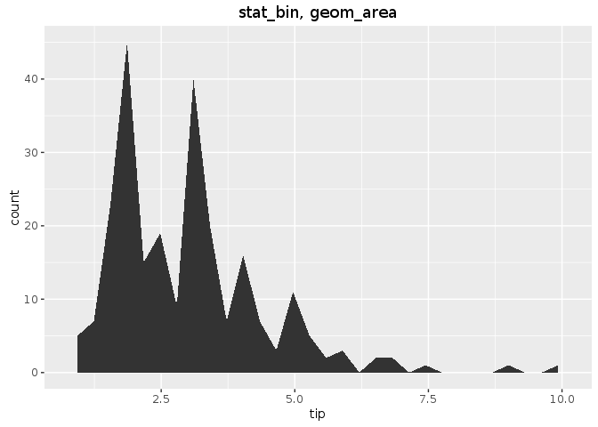<!-- -->

* geom = "point", geom="line"


```r
plot.1D + stat_bin(geom = "point") + ggtitle("stat_bin, geom_point")
```

```
## `stat_bin()` using `bins = 30`. Pick better value with `binwidth`.
```

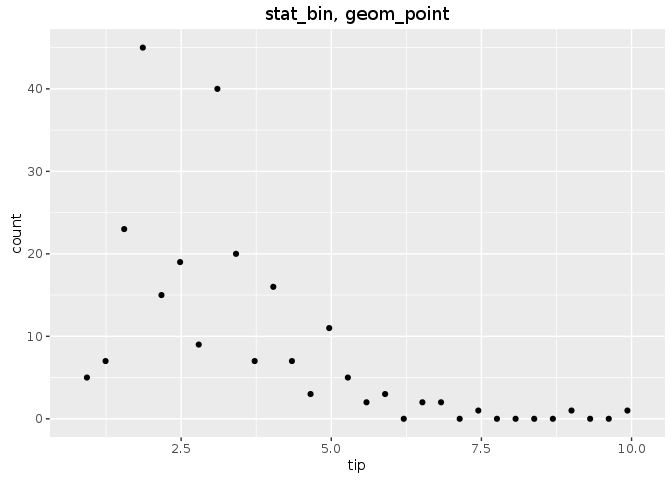<!-- -->

```r
plot.1D + stat_bin(geom = "line") + ggtitle("stat_bin, geom_line")
```

```
## `stat_bin()` using `bins = 30`. Pick better value with `binwidth`.
```

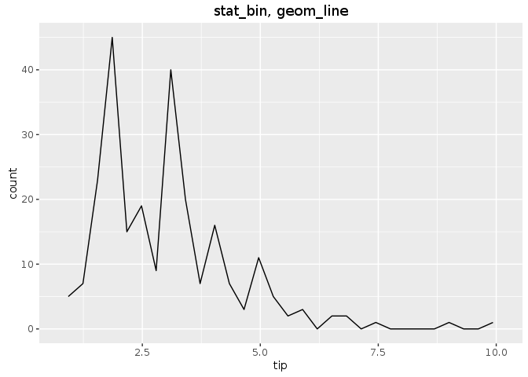<!-- -->

## Position adjustment

- dodge : 겹쳐지는 부분을 옆으로 나란히 정렬하는 방법
- fill : 전체영역을 칠하기
- identity : 그대로 나타내기
- jitter : 겹쳐진 점을 흐트려서 나타내기
- stack : 겹쳐진 부분을 위에 쌓는 형태로 그리기

position = "stack"  
position = "dodge"  
theme(legend.position = "none")
그림에서 범례를 제외시키기 위한옵션


```r
plot.pos <- ggplot(tipping,aes(x = day, fill = sex, shape = sex)) 
plot.pos + geom_bar(position = "stack") + ggtitle("stack") + theme(legend.position="none")
```

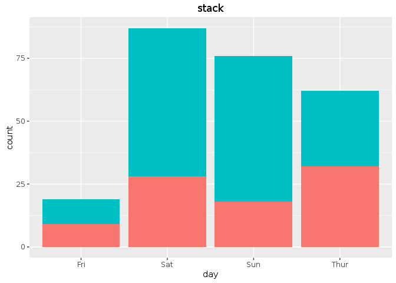<!-- -->

```r
plot.pos+ geom_bar(position = "dodge") + ggtitle("dodge") + theme(legend.position="none ")
```

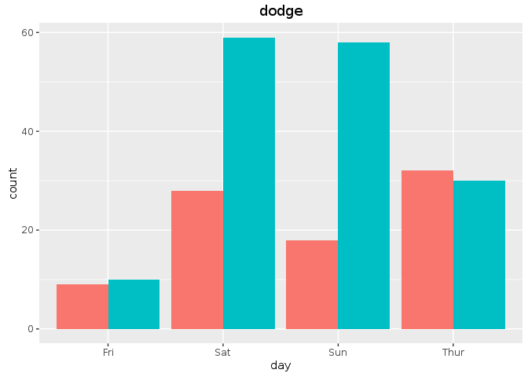<!-- -->

* position = "fill"
* position = "jitter"

```r
plot.pos + geom_bar(position  = "fill") + ggtitle("fill") + theme(legend.position="none ")
```

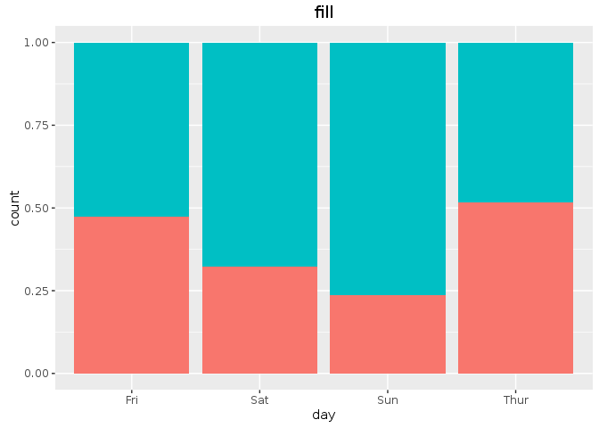<!-- -->

```r
plot.pos + geom_point(aes(y=totbill,color=sex,shape=sex),position="jitter") + ggtitle("jitter") + theme(legend.position="none  ")
```

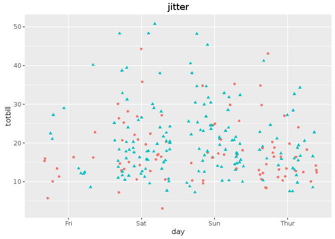<!-- -->
*position = "identity"
alpha


```r
plot.pos <- ggplot(tipping,aes(x   = day  , fill = sex, shape = sex))
plot.pos + geom_bar(position  = "identity") + ggtitle("identity") + theme(legend.position="none ")
```

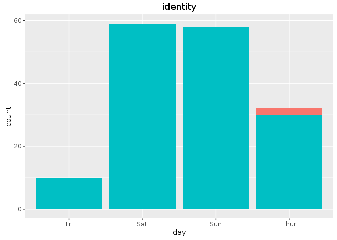<!-- -->

```r
plot.pos + geom_bar(position  = "identity", alpha  = I(0.5)) + ggtitle("identity with alpha") + theme(legend.position="none ")
```

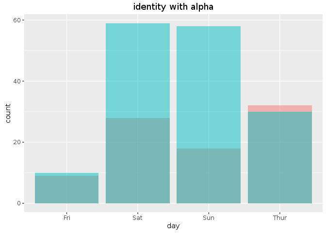<!-- -->

## Scale 

shape, size, color
scale_color_hue 

```r
plot.scale1  <- ggplot(tipping,  aes(x=totbill,  y = tip, color = sex, shape = sex, size  = size)) + geom_point()
plot.scale1  + scale_color_hue("Gender", labels = c("Female", "Male"))
```

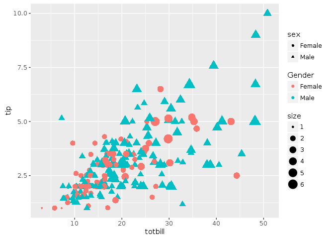<!-- -->

Scale_color_brewer

```r
 plot.scale1 + scale_color_brewer(palette="Set1")
```

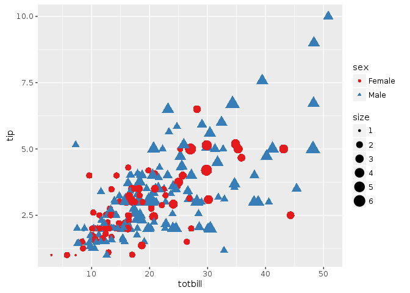<!-- -->

- scale_x_continuous : x축에 대한 옵션을 제시하는 함수
- breaks = c(20,40) : 20과 40에 눈금을 표시
- scale_y_continuous : y축에 대한 옵션을 제시하는 함수


```r
plot.scale2  <- ggplot(tipping,aes(x=totbill,y=tip)) + geom_point()
plot.scale2  + scale_x_continuous(breaks=c(20,40)) + scale_y_continuous(breaks=1:10)
```

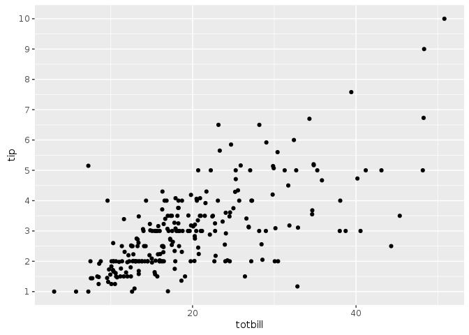<!-- -->

- coord_trans : 각 축을 함수를 이용하여 변환할 수 있도록 하는 함수
- xtrans = “log10” : log10 함수를 이용하여 x축을 변환
- ytrans = “log10” : log10 함수를 이용하여 y축을 변환


```r
#plot.scale2 + coord_trans(xtrans="log10",ytrans="sqrt")
# Error: `xtrans` arguments is deprecated; please use `x` instead.
plot.scale2 + coord_trans(x="log10",y="sqrt")
```

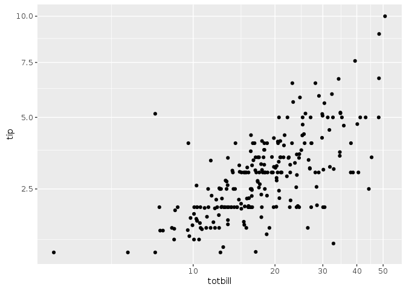<!-- -->

## Faceting 

* facet_grid(A~B) : 변수 A의 범주를 행으로, 변수 B의 범주를 열로 하여 행렬형태로 그림을 그리는 방법
* margins=TRUE : 각 행, 열의 마지막에 주변분포의 그림을 그려줌


```r
plot.facet <- ggplot(tipping,aes(x = totbill, y = tip)) + geom_point()
plot.facet +  facet_grid(sex ~ smoker , margins  = TRUE)
```

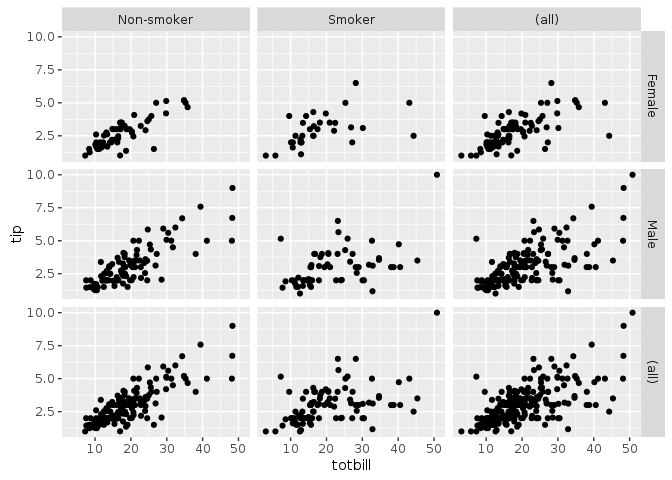<!-- -->

facet_wrap(~A) : 하나의 범주형 변수 A를 이용하는 방법으로 ncol, nrow
옵션을 이용하여 그림 행렬의 모양을 지정


```r
plot.facet + facet_wrap(~ size, ncol = 6)
```

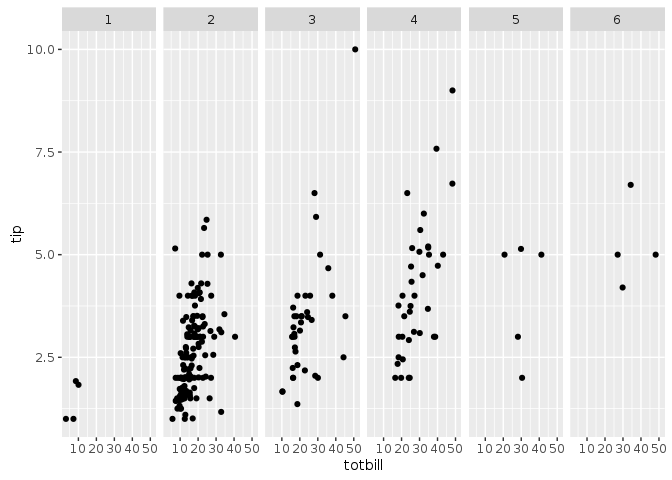<!-- -->

cut_interval, cut_number 함수를 이용하여 연속변수를 범주화

- cut_interval : 자료 값의 범위를 일정하게 하여 n개의 그룹으로 나누어 주는 함수
- cut_number : 각 그룹의 자료수가 같아지도록 n개의 그룹으로 나누어주는 함수


```r
tipping$tipgroup1 <-  cut_interval(tipping$tiprate,n=3)
tipping$tipgroup2 <-  cut_number(tipping$tiprate,n=3)
plot.newfacet <- ggplot(tipping,aes(x=totbill,y=tip)) + geom_point()
plot.newfacet + facet_wrap(~tipgroup1)
```

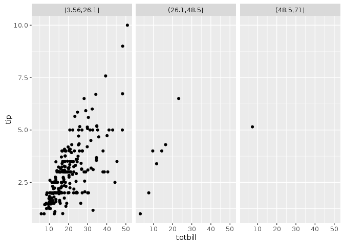<!-- -->

```r
plot.newfacet + facet_wrap(~tipgroup2)
```

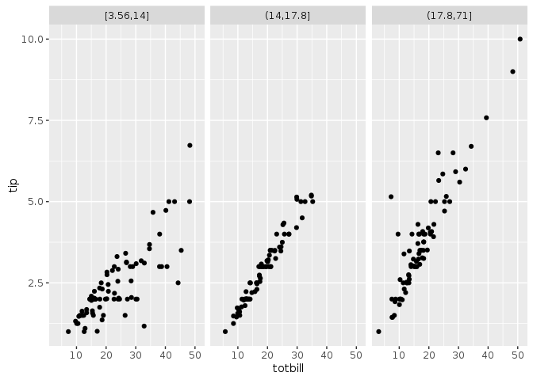<!-- -->

## Theme

보고서 작성을 위해 그림을 다듬는 데에 필요한 옵션들

- xlab/ylab : x축/y축 이름을 지정
- ggtitle : 그림의 제목을 지정


```r
plot.theme <- ggplot(tipping, aes(x = totbill, y = tip))
plot.theme + geom_point() + xlab("Total Bill") + ylab("Tip") + ggtitle("Total Bill and Tip")
```

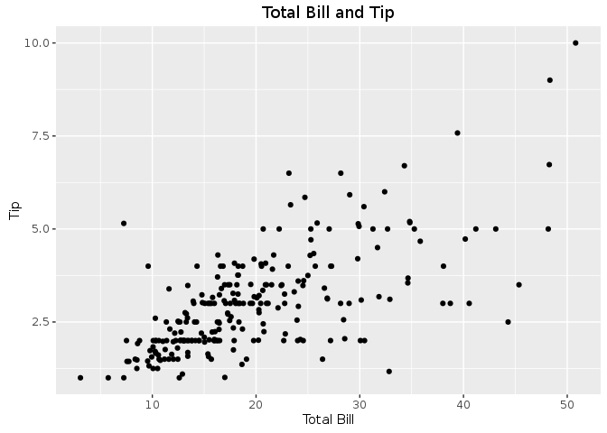<!-- -->

Theme 함수를 이용하여 그림의 전반적인 사항들 지정

- plot.title : 그림 제목에 관한 옵션 지정


```r
plot.theme + geom_point() + xlab("Total Bill") + ylab("Tip") + ggtitle("Total Bill and Tip") + theme(plot.title = element_text(color = " red", face = "bold", hjust = 0))
```

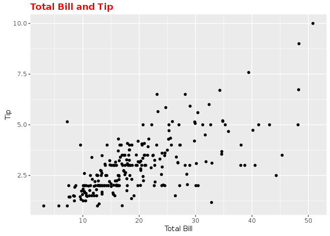<!-- -->

last_plot : 마지막으로 그린 그림을 불러오는 함수
theme_bw : 배경색을 흰색으로 변경하는 함수
panel.grid.minor/panel.grid.major : 격자선에 관한 옵
panel.border : 그림 테두리에 관한 옵션
axis.line : x, y축의 선에 관한 옵션


```r
last_plot()+theme_bw()+ theme(panel.grid.major=element_blank(),
                              panel.grid.minor=element_blank(),
                              panel.border=element_blank(),
                              axis.line  = element_line())
```

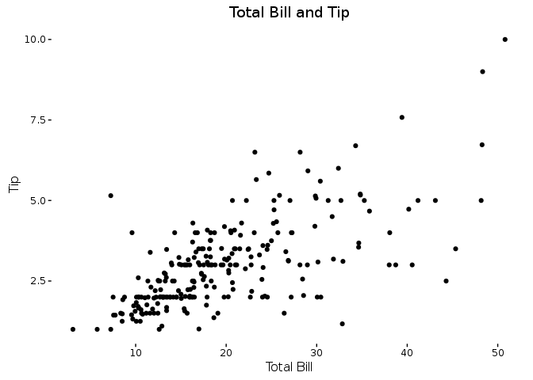<!-- -->

legend.position = “none” : 범례를 생략하기 위한 옵션


```r
plot.theme  +
    geom_point(aes(color = sex, shape = sex))  +
    theme(legend.position = "none ")
```

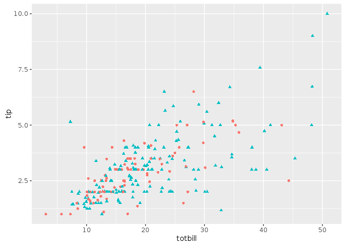<!-- -->

geom_text : 그림에 문자를 삽입하기 위한 함수
expression : 수식을 표현하기 위한 함수


```r
lm.result <- lm(tip~totbill,data = tipping)
ab <- round(coef(lm.result),2)
ggplot(tipping,aes(x=totbill,y=tip))+
          geom_point()+
          geom_smooth(method="lm")+
          geom_text(data  = NULL,x=10,y=8.5,
            label=paste("y =",ab[1],"+",ab[2],"x"), hjust=0)  +
          ggtitle(expression(paste(hat(beta)[0],"+",hat(beta)[1],"x")))
```

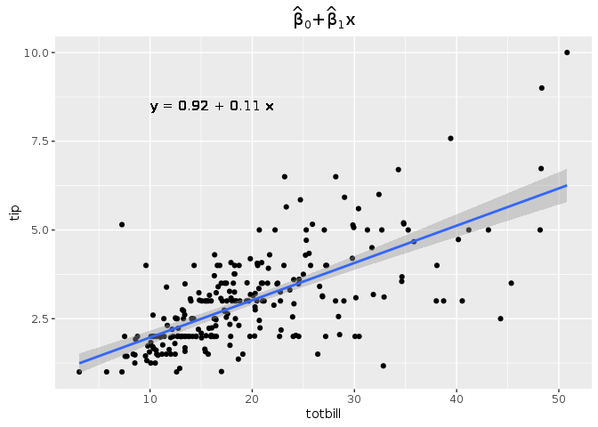<!-- -->

ggsave

- R 세션에서 활성화 되어 있는 R Graphics Device에 그려져 있는 그림을
저장해주는 함수
- 파일 이름의 확장자에 맞는 형태의 그림으로 저장
- MS 오피스나 아래한글, 혹은 웹 문서를 위해서는 png 파일을 이용


```r
ggsave("sample-plot.png")
```

```
## Saving 7 x 5 in image
```

