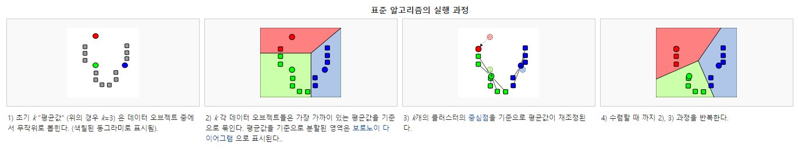
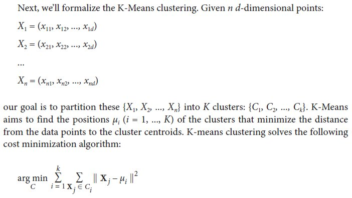

Clustering 이란? K-Means이란?

- Clustering은 d-차원의 N개의 객체를 유사한 것끼리 K개의 그룹으로 묶는 process.
- 하나의 cluster내에 있는 객체는 유사함.







### Application Areas for Clustering

Marketing
    - 고객 구매이력 데이터셋에서 비슷한 구매패턴을 갖는 그룹을 발굴.
    
Document classification
    - 비슷한 접근 패턴을 찾아서 web log data을 군집화
    
Insurance
    - 점재적인 사기보험과 같은 고비용 청부를 하는 자동차 보험 가입자를 그룹화
    
    
### Run of Spark K-Means Implementation
    
- CentOS 6.7
- 사전 준비

```{bash  eval=FALSE}
sudo yum -y install libcurl-devel
```

- ubuntu 16.04
- 사전 준비
```{bash eval=FALSE}
sudo apt-get install libcurl4-gnutls-dev
```


```{r   eval=FALSE}  
install.packages("sparklyr" , repos = 'http://cran.nexr.com') 
install.packages("DBI" , repos = 'http://cran.nexr.com') 
```


```{r}
library(sparklyr)
#spark_available_versions()
#spark_install(version = "1.6.1")

if (nchar(Sys.getenv("SPARK_HOME")) < 1) {
  Sys.setenv(SPARK_HOME = "/home/biospin/.cache/spark/spark-1.6.1-bin-hadoop2.6")
}
sc <- spark_connect(master = "local")
```

    
    
```{r eval=FALSE} 
install.packages("dplyr", repos = "http://cran.nexr.com" )
install.packages('ggplot2', repos = 'http://cran.nexr.com')
```

```{r}
library(dplyr)
iris_tbl <- copy_to(sc, iris)
```


```{r}
kmeans_model <- iris_tbl %>%
  select(Petal_Width, Petal_Length) %>%
  ml_kmeans(centers = 3)

# print our model fit
print(kmeans_model)
```

```{r}
# predict the associated class
predicted <- sdf_predict(kmeans_model, iris_tbl) %>%
  collect
table(predicted$Species, predicted$prediction)
```

```{r}
library(ggplot2)

# plot cluster membership
sdf_predict(kmeans_model) %>%
  collect() %>%
  ggplot(aes(Petal_Length, Petal_Width)) +
  geom_point(aes(Petal_Width, Petal_Length, col = factor(prediction + 1)),
             size = 2, alpha = 0.5) + 
  geom_point(data = kmeans_model$centers, aes(Petal_Width, Petal_Length),
             col = scales::muted(c("red", "green", "blue")),
             pch = 'x', size = 12) +
  scale_color_discrete(name = "Predicted Cluster",
                       labels = paste("Cluster", 1:3)) +
  labs(
    x = "Petal Length",
    y = "Petal Width",
    title = "K-Means Clustering",
    subtitle = "Use Spark.ML to predict cluster membership with the iris dataset."
  )
```

